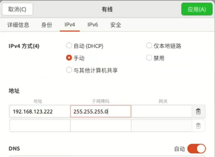
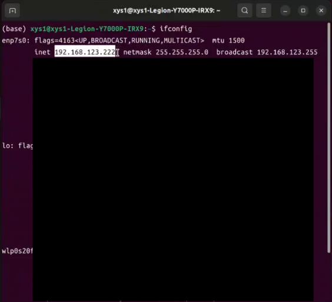
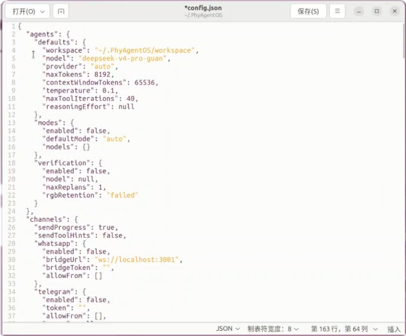
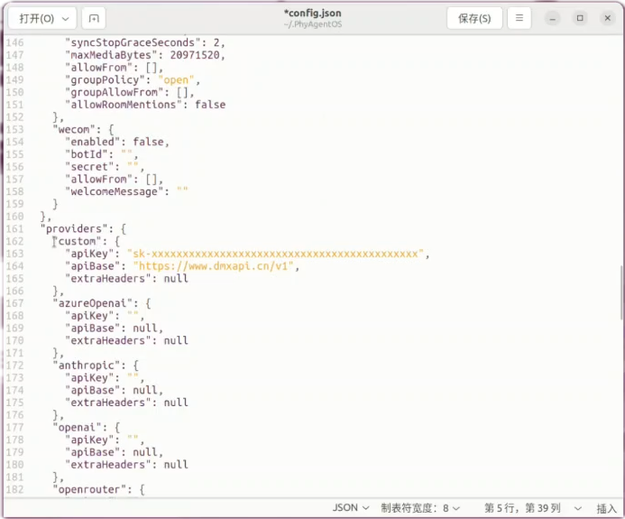
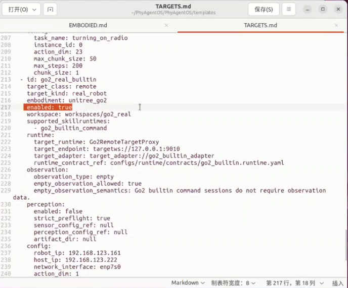
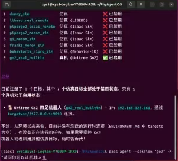

# Unitree Go2 Quick Start Guide

> Target branch: `preview` · [中文](UNITREE_GO2_QUICK_START.md)

This guide explains how to connect a Unitree Go2 to the
`go2_real_builtin` Target in PhyAgentOS over a wired network from a Linux host.
The current integration supports posture changes and short, low-speed motion.
It does not support navigation, visual servoing, or extended autonomous motion.

> [!WARNING]
> The Go2 is a physical motion system. For initial tests, clear the surrounding
> area, place the robot on a level non-slip surface, and keep an operator within
> immediate emergency-stop range. Complete `--dry-run` first. Test stand, stop,
> and stand-down commands before attempting a short movement.

## 1. Integration Overview

PhyAgentOS and Unitree SDK2 run in separate Python environments:

```text
PhyAgentOS (Python >= 3.11)
        │  TargetWS / WebSocket, default 127.0.0.1:9010
        ▼
Go2 TargetWS Server (Python 3.10 + Unitree SDK2)
        │  CycloneDDS over the wired interface
        ▼
Unitree Go2 (default 192.168.123.161)
```

The default values are shown below. Replace them consistently if your robot or
host uses different settings.

| Item | Default |
|---|---|
| Go2 wired IP | `192.168.123.161` |
| Host wired IP | `192.168.123.222/24` |
| SDK interface | `enp4s0` (use the value detected on your host) |
| TargetWS endpoint | `targetws://127.0.0.1:9010` |

## 2. Prepare the Robot and Host

Recommended prerequisites:

- a Unitree Go2 with a sufficiently charged battery;
- an Ubuntu/Linux host with wired Ethernet;
- an Ethernet cable;
- Conda or Miniconda;
- an API key for a supported model provider;
- a clear, level, non-slip test area.

Connect the cable and power on the robot. In the host network settings, set the
wired IPv4 method to manual, use `192.168.123.222` as the address, and use
`255.255.255.0` (`/24`) as the subnet mask. A direct connection normally does
not need a gateway or DNS server.

<p align="center">
  
</p>

Identify the wired interface and confirm its address:

```bash
ip -brief address
ip route
```

On older systems, you can also use:

```bash
ifconfig
```

Record the interface that owns `192.168.123.222`, such as `enp4s0`. Do not copy
the example interface name without checking your host.

<p align="center">
  
</p>

Verify that the host can reach the robot:

```bash
ping -c 4 192.168.123.161
```

Continue only after the robot replies. If it does not, check the cable, robot
power, host static IP, subnet mask, and interface state.

## 3. Install PhyAgentOS

Create a Python 3.11 environment and install the `preview` branch:

```bash
conda create -n paos python=3.11 -y
conda activate paos

git clone --branch preview --single-branch https://github.com/PhyAgentOS/PhyAgentOS.git
cd PhyAgentOS
python -m pip install -U pip
pip install -e .
```

Verify the command-line entry point:

```bash
paos --help
```

Run all subsequent commands containing `PhyAgentOS/...` from the repository
root.

## 4. Install the Unitree SDK2 Environment

Use a separate Python 3.10 environment for Unitree SDK2. The PhyAgentOS `paos`
environment does not need this SDK.

```bash
conda create -n go2-sdk python=3.10 -y
conda activate go2-sdk
python -m pip install -U pip setuptools wheel

pip install "cyclonedds==0.10.2" numpy opencv-python websockets msgpack

cd ~
git clone https://github.com/unitreerobotics/unitree_sdk2_python.git
cd unitree_sdk2_python
pip install -e .
```

If the last command reports that CycloneDDS cannot be found, build
CycloneDDS 0.10.x and reinstall the SDK:

```bash
cd ~
git clone --branch releases/0.10.x https://github.com/eclipse-cyclonedds/cyclonedds.git
cd cyclonedds
mkdir -p build install
cd build
cmake .. -DCMAKE_INSTALL_PREFIX=../install
cmake --build . --target install

cd ~/unitree_sdk2_python
export CYCLONEDDS_HOME=~/cyclonedds/install
pip install -e .
```

Verify SDK imports:

```bash
conda run -n go2-sdk python - <<'PY'
from unitree_sdk2py.go2.sport.sport_client import SportClient
import cyclonedds
print("go2-sdk import ok")
PY
```

## 5. Initialize and Configure PhyAgentOS

Return to the repository root and initialize PhyAgentOS:

```bash
conda activate paos
cd /path/to/PhyAgentOS
paos onboard
```

This creates `~/.PhyAgentOS/config.json` and the default workspace at
`~/.PhyAgentOS/workspace`.

<p align="center">
  
</p>

Edit `~/.PhyAgentOS/config.json`. Configure the model, the API key under its
matching provider, and the Go2 Target. The fragment below only shows relevant
fields. Merge it into the complete JSON generated by `paos onboard`; do not
replace the entire file with this fragment.

```json
{
  "agents": {
    "defaults": {
      "model": "<provider>/<model>"
    }
  },
  "providers": {
    "<provider>": {
      "apiKey": "<your-api-key>"
    }
  },
  "runtime": {
    "enabled": true,
    "targetEnabled": {
      "go2_real_builtin": true
    }
  }
}
```

Never commit a real API key or paste it into public logs.

<p align="center">
  
</p>

`runtime.targetEnabled` overrides the `enabled` value in `TARGETS.md` and is the
recommended way to enable the Target. Alternatively, set
`go2_real_builtin.enabled` to `true` in the runtime workspace's `TARGETS.md`:

<p align="center">
  
</p>

If the robot IP, host IP, or interface differs from the default, keep the
workspace documentation in sync:

- update `go2_real_builtin.config` in
  `~/.PhyAgentOS/workspace/TARGETS.md`;
- update Runtime Connection in the `go2_real_builtin` section of
  `~/.PhyAgentOS/workspace/EMBODIED.md`.

`TARGETS.md` is generated automatically on the first Agent start. To customize
it before that first start, copy the repository template:

```bash
cp PhyAgentOS/templates/TARGETS.md ~/.PhyAgentOS/workspace/TARGETS.md
```

The TargetWS Server's `--network-interface` and `--robot-ip` arguments must
still use the same real values.

## 6. Complete a Dry Run First

In terminal A, start a TargetWS Server that neither connects to nor controls the
physical robot:

```bash
conda run --no-capture-output -n go2-sdk \
  python PhyAgentOS/runtime/targets/remote/go2/server.py \
  --host 0.0.0.0 \
  --port 9010 \
  --network-interface enp4s0 \
  --robot-ip 192.168.123.161 \
  --dry-run
```

The following message confirms that the service is listening:

```text
Go2 TargetWS server listening on targetws://0.0.0.0:9010
```

In terminal B, start the Agent:

```bash
conda activate paos
cd /path/to/PhyAgentOS
paos agent
```

First ask, "How many robots are connected?" Then issue an explicit request:

```text
Use the go2_real_builtin Target to execute stand_up. This is a dry run; do not execute other actions.
```

Dry-run mode does not send SDK commands to the Go2. Continue to physical tests
only after the Agent detects `go2_real_builtin`, creates a Session, and reports
success.

<p align="center">
  
</p>

## 7. Start the Physical Robot

Stop the dry-run Server with `Ctrl+C`. Confirm again that the area is clear, the
surface is level, and the operator is ready. In terminal A, restart the Server
without `--dry-run`:

```bash
conda run --no-capture-output -n go2-sdk \
  python PhyAgentOS/runtime/targets/remote/go2/server.py \
  --host 0.0.0.0 \
  --port 9010 \
  --network-interface enp4s0 \
  --robot-ip 192.168.123.161
```

Run `paos agent` in terminal B. Test one command at a time in this order,
checking the robot after every step:

1. `Make the Go2 stand up.`
2. `Put the Go2 into balance stand.`
3. `Stop the Go2's movement.`
4. `Make the Go2 stand down.`

Only after those checks, request one short movement:

```text
Make the Go2 stand up and enter balance stand, then move with vx=0.1, vy=0, and vyaw=0 for 0.5 seconds, and finally stop.
```

## 8. Supported Commands and Limits

| Command | Description |
|---|---|
| `stand_up` | Stand up |
| `balance_stand` | Enter balance stand |
| `recovery_stand` | Recover to standing |
| `stand_down` / `squat` | Stand down/squat |
| `damp` | Enter damping mode |
| `stop` | Stop movement with `StopMove()` |
| `move` | Short velocity-controlled movement |

The TargetWS Server clamps `move` parameters to these ranges:

| Parameter | Range | Meaning |
|---|---:|---|
| `vx` | `[-0.5, 0.5]` m/s | Forward/backward velocity |
| `vy` | `[-0.2, 0.2]` m/s | Lateral velocity |
| `vyaw` | `[-0.5, 0.5]` rad/s | Yaw velocity |
| `duration_s` | `[0.1, 1.0]` s | Duration of one movement |

The Server calls `StopMove()` after every `move`. This Target does not expose
raw SDK commands to the Agent and does not accept arbitrary action chunks.

## 9. Stop and Disconnect

For a normal shutdown:

1. execute `stop`;
2. after confirming that it is safe, execute `stand_down`;
3. exit `paos agent` with `Ctrl+C`;
4. exit the Go2 TargetWS Server with `Ctrl+C`.

The TargetWS Server attempts another `StopMove()` while closing. This is not a
replacement for physical emergency-stop measures or operator supervision.
Prioritize the robot's physical safety controls if motion becomes abnormal.

## 10. Troubleshooting

| Symptom | Checks and resolution |
|---|---|
| `ping` fails | Check the cable, power, `192.168.123.222/24`, and whether the interface is UP. Temporarily disconnect other networks if they take precedence in routing. |
| `unitree_sdk2py` cannot be imported | Confirm that the Server uses the `go2-sdk` environment and that `pip install -e .` completed in `unitree_sdk2_python`. |
| CycloneDDS cannot be found | Build 0.10.x as described in section 4, set `CYCLONEDDS_HOME`, and reinstall the SDK. |
| Server starts but the robot does not respond | Confirm that `--network-interface` is the wired interface, verify `ping`, and inspect Server logs for SDK error codes. |
| `Connection refused` or TargetWS is unreachable | Confirm that the Server listens on `9010`. Use `targetws://127.0.0.1:9010` on the same host. For separate hosts, set the Endpoint in `TARGETS.md` to the Server host IP and configure the firewall. |
| `TARGET_DISABLED` | Set `runtime.targetEnabled.go2_real_builtin` to `true` in `config.json`, or edit the workspace's `TARGETS.md`. |
| Agent reports a model or API-key error | Check the model name, provider selection, and the matching `apiKey`. Do not place a key under the wrong provider. |
| Movement parameters appear ineffective | Place all `move` values under `params`. The Server clamps values outside the supported ranges. |

## 11. Safety and Capability Boundaries

- `--host 0.0.0.0` listens on every host interface. Use it only on a trusted
  network and restrict port `9010` with a firewall. For a same-host deployment,
  you can use `--host 127.0.0.1`.
- Do not expose raw SDK calls, safety-disabling controls, or long-duration
  movement to the Agent.
- Do not use this integration for navigation, visual servoing, stairs, complex
  terrain, or unattended operation.
- Passing Preflight means the configuration and runtime contracts are
  compatible; it is not physical-robot safety certification.
- Prefer `stop` before changing tasks. Start with low velocities and short
  durations, then increase cautiously only after validation.

## Related Documentation

- [Unitree Go2 TargetWS README](../../PhyAgentOS/runtime/targets/remote/go2/README.md)
- [PhyAgentOS User Manual](../en/02-user-manual.md)
- [Runtime Configuration Reference](../en/04-runtime-configuration-reference.md)
- [Communication Architecture](COMMUNICATION_en.md)
